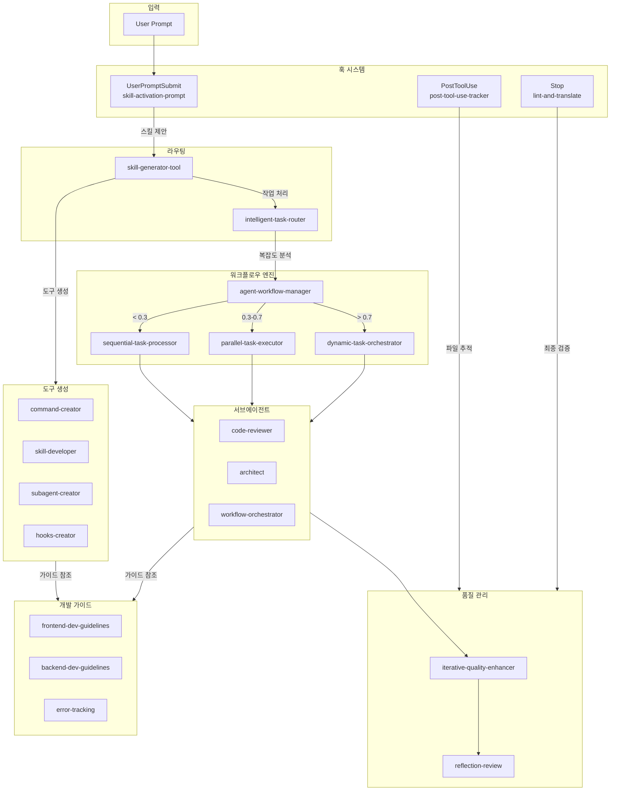

# CC-Skills

Claude Code용 스킬 및 훅 컬렉션 플러그인입니다.

---

## 아키텍처 개요



### 연결 흐름

1. **입력 처리**
   User Prompt → UserPromptSubmit 훅

2. **라우팅**
   skill-generator-tool / intelligent-task-router

3. **실행**
   복잡도별 워크플로우 선택 → 에이전트 실행

4. **품질 검증**
   iterative-quality-enhancer → reflection-review

---

## 설치

```bash
# 마켓플레이스 추가
/plugin marketplace add inchan/cc-skills

# 설치 및 활성화
/plugin install cc-skills@inchan-cc-skills
/plugin enable cc-skills@inchan-cc-skills
```

---

## 스킬 목록

<details>
<summary><b>워크플로우 관리</b> (7개)</summary>

**agent-workflow-manager**
- 전체 워크플로우 자동 관리
- 복잡도 분석 → Router/Sequential/Parallel/Orchestrator → Evaluator 자동 연결

**agent-workflow-advisor**
- 패턴 추천 어드바이저
- 5가지 패턴 중 최적 패턴 제안

**agent-workflow-orchestrator**
- 고급 오케스트레이션
- 다중 에이전트 조율

**intelligent-task-router**
- 작업 분류 및 라우팅
- 8개 카테고리로 분류 후 적합한 경로로 라우팅

**parallel-task-executor**
- 병렬 작업 실행
- Sectioning/Voting 모드로 2-10x 속도 향상

**dynamic-task-orchestrator**
- 복잡한 프로젝트 조율
- 6개 전문 워커 동적 할당 (복잡도 0.7+)

**sequential-task-processor**
- 순차 작업 처리
- 의존성 있는 작업 단계별 실행

</details>

<details>
<summary><b>품질 관리</b> (2개)</summary>

**iterative-quality-enhancer**
- 품질 평가 및 최적화
- 5개 차원 평가, 최대 5회 반복 개선

**reflection-review**
- 코드 결과 평가 및 성찰 기반 리뷰
- 6개 영역 점수화, P0/P1/P2 피드백

</details>

<details>
<summary><b>개발 가이드</b> (3개)</summary>

**frontend-dev-guidelines**
- React/TypeScript/MUI v7
- Suspense, lazy loading, TanStack Router

**backend-dev-guidelines**
- Node.js/Express/Prisma
- 레이어드 아키텍처, Zod 검증

**error-tracking**
- Sentry v8 패턴
- 에러 캡처, 성능 모니터링

</details>

<details>
<summary><b>도구 생성</b> (5개)</summary>

**skill-generator-tool**
- 도구 타입 추천
- Command/Skill/Subagent/Hook 중 최적 타입 선택

**command-creator**
- 슬래시 커맨드 생성
- frontmatter + 프롬프트 .md 파일

**skill-developer**
- 스킬 개발 종합 가이드
- SKILL.md + 번들 리소스, 500줄 규칙, Anthropic 공식 표준

**subagent-creator**
- 서브에이전트 생성
- 7개 템플릿 기반

**hooks-creator**
- 훅 생성
- 6개 이벤트 지원

</details>

<details>
<summary><b>AI 연동</b> (2개)</summary>

**dual-ai-loop**
- 외부 AI CLI 협업
- codex, qwen, copilot, rovo-dev, aider
- 계획-구현-리뷰 사이클

**cli-updater**
- CLI 버전 업데이트
- 어댑터 스킬 및 문서 자동 업데이트

</details>

<details>
<summary><b>프롬프트</b> (2개)</summary>

**meta-prompt-generator-v2**
- 슬래시 커맨드용 프롬프트 생성
- 구조화된 단계별 병렬 처리 가능한 프롬프트

**prompt-enhancer**
- 컨텍스트 기반 프롬프트 개선
- 프로젝트 구조/패턴 분석

</details>

<details>
<summary><b>기타</b> (2개)</summary>

**route-tester**
- 인증 라우트 테스트
- mock 인증 패턴

**web-to-markdown**
- 웹페이지 변환
- URL → 마크다운 파일

</details>

---

## 에이전트

**code-reviewer**
- 코드 품질/보안 리뷰
- OWASP Top 10, SOLID/DRY/KISS 원칙
- Critical → Low 우선순위 피드백

**architect**
- 시스템 아키텍처 설계
- ADR 형식 문서화
- 트레이드오프 분석

**workflow-orchestrator**
- 워크플로우 오케스트레이션
- 복잡도(0.0-1.0) 분석
- 서브에이전트 실행 조율

---

## 훅

**UserPromptSubmit**
- `skill-activation-prompt.js`
- 키워드/인텐트 매칭 → 스킬 제안

**PostToolUse**
- `post-tool-use-tracker.sh`
- Edit/Write 후 파일 추적

**Stop**
- `stop-hook-lint-and-translate.sh`
- 린트 실행 및 번역

---

## 워크플로우 선택

**복잡도 < 0.3**
- `sequential-task-processor`
- 단순 순차 작업

**복잡도 0.3 - 0.7**
- `parallel-task-executor`
- 독립적인 다중 작업

**복잡도 > 0.7**
- `dynamic-task-orchestrator`
- 복잡한 시스템 구축

**자동 판단**
- `agent-workflow-manager`
- 복잡도 자동 분석

## 사용법

플러그인 활성화 후 프롬프트를 입력하면 `UserPromptSubmit` 훅이 적합한 스킬을 자동으로 제안합니다.

```bash
# 스킬 수동 호출
/skill frontend-dev-guidelines
/skill backend-dev-guidelines
/skill agent-workflow-manager
```

## 디렉토리 구조

```
cc-skills/
├── .claude-plugin/       # 플러그인 메타데이터
│   ├── plugin.json
│   └── marketplace.json
├── .claude/
│   ├── skills/           # 스킬 컬렉션 (23개)
│   ├── commands/         # 슬래시 커맨드
│   └── hooks/            # 원본 훅 스크립트
├── agents/               # 서브에이전트 (3개)
├── hooks/                # 플러그인 훅 설정
└── scripts/              # 컴파일된 훅 스크립트
```

## 요구사항

- Claude Code CLI
- Node.js 18+

## 라이선스

MIT
